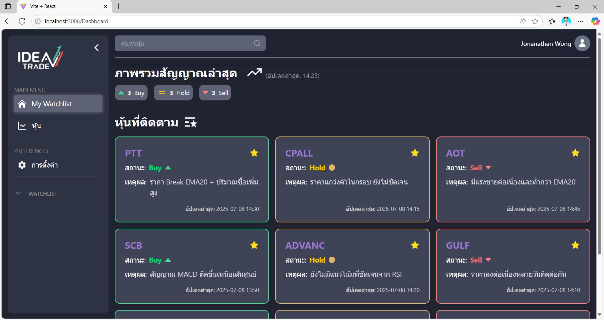

# Stock Signal Labeling & Backtesting System

[](https://react.dev/)
[](https://vitejs.dev/)
[](https://tailwindcss.com/)

## 📌 Overview

A sophisticated web application for analyzing stock indicators, generating trading signals (Buy/Hold/Sell), and performing comprehensive backtesting to evaluate strategy effectiveness.



## ✨ Features

- **Signal Generation:** Automatically labels stock signals based on technical indicators
- **Interactive Visualization:** Dynamic charts for technical analysis
- **Modular Architecture:** Component-based structure for easy maintenance

## 🚀 Getting Started

### Prerequisites

- Node.js (v16 or higher)
- npm (v8 or higher)

### Installation

```bash
# Clone the repository
git clone https://github.com/yourusername/stock-signal-analyzer.git

# Navigate to project directory
cd stock-signal-analyzer

# Install dependencies
npm install

# Start development server
npm run dev
```

The application will be available at [http://localhost:3006](http://localhost:3006).

## 🛠️ Project Structure

```
STOCKSIGNAL/
├── src/
│   ├── components/    # Reusable UI components
│   ├── assets/        # Static assets (images, fonts, etc.)
│   └── pages/         # Application pages
├── public/            # Public assets
└── vite.config.js     # Vite configuration
```

## 📈 Technical Stack

- **Frontend:** React 18, Vite 4
- **Styling:** TailwindCSS 3
- **Charts:** LightweightChart

## 🤝 Contributing

We welcome contributions! Please follow these steps:

1. Fork the repository
2. Create your feature branch (`git checkout -b feature/AmazingFeature`)
3. Commit your changes (`git commit -m 'Add some AmazingFeature'`)
4. Push to the branch (`git push origin feature/AmazingFeature`)
5. Open a Pull Request